<div align="center">
  
</div>

<br/>

```text
$ whoami
> florian — software engineer · cologne, germany 🥳
> status:   coding to good music 🎸
> hobbies:  biking 🚴‍♂️ & hiking 🥾 also with a tent ⛺
```

<br/>

<samp>🔗 connect</samp>

<p>
<a href="https://linkedin.com/in/fl0r1an" target="blank"></a><a href="https://instagram.com/fl0._.r1an" target="blank"></a>
</p>

---

<details>
<summary><samp>📦 experience --list</samp></summary>
<br/>
<table>
  <tr>
    <td align="center" width="60"><a href="https://angular.io" target="_blank" rel="noreferrer"></a></td>
    <td align="center" width="60"><a href="https://getbootstrap.com" target="_blank" rel="noreferrer"></a></td>
    <td align="center" width="60"><a href="https://www.w3schools.com/cs/" target="_blank" rel="noreferrer"></a></td>
    <td align="center" width="60"><a href="https://dart.dev/" target="_blank" rel="noreferrer"></a></td>
    <td align="center" width="60"><a href="https://dotnet.microsoft.com/" target="_blank" rel="noreferrer"></a></td>
    <td align="center" width="60"><a href="https://www.w3.org/html" target="_blank" rel="noreferrer"></a></td>
    <td align="center" width="60"><a href="https://gitlab.com/" target="_blank" rel="noreferrer"></a></td>
    <td align="center" width="60"><a href="https://laravel.com/" target="_blank" rel="noreferrer"></a></td>
    <td align="center" width="60"><a href="https://www.php.net" target="_blank" rel="noreferrer"></a></td>
    <td align="center" width="60"><a href="https://reactjs.org/" target="_blank" rel="noreferrer"></a></td>
    <td align="center" width="60"><a href="https://symfony.com" target="_blank" rel="noreferrer"><picture><source media="(prefers-color-scheme: dark)" srcset="./icons/symfony_black.svg" width="40" height="40"/></picture></a></td>
    <td align="center" width="60"><a href="https://vuetifyjs.com/en/" target="_blank" rel="noreferrer"></a></td>
  </tr>
</table>
</details>

<details>
<summary><samp>❤️ preferences --list</samp></summary>
<br/>
<table>
  <tr>
    <td align="center" width="60"><a href="https://developer.apple.com/" target="_blank" rel="noreferrer"><picture><source media="(prefers-color-scheme: dark)" srcset="./icons/apple_logo_white.svg" width="40" height="40"/></picture></a></td>
    <td align="center" width="60"><a href="https://www.w3schools.com/css/" target="_blank" rel="noreferrer"></a></td>
    <td align="center" width="60"><a href="https://directus.io/" target="_blank" rel="noreferrer"><picture><source media="(prefers-color-scheme: dark)" srcset="./icons/directus_white.svg" width="40" height="40"/></picture></a></td>
    <td align="center" width="60"><a href="https://github.com/" target="_blank" rel="noreferrer"><picture><source media="(prefers-color-scheme: dark)" srcset="./icons/github-white.svg" width="40" height="40"/></picture></a></td>
    <td align="center" width="60"><a href="https://nuxt.com" target="_blank" rel="noreferrer"></a></td>
    <td align="center" width="60"><a href="https://flutter.dev/" target="_blank" rel="noreferrer"></a></td>
    <td align="center" width="60"><a href="https://ionicframework.com/" target="_blank" rel="noreferrer"></a></td>
    <td align="center" width="60"><a href="https://developer.mozilla.org/en-US/docs/Web/JavaScript" target="_blank" rel="noreferrer"></a></td>
    <td align="center" width="60"><a href="https://sass-lang.com" target="_blank" rel="noreferrer"></a></td>
    <td align="center" width="60"><a href="https://tailwindcss.com/" target="_blank" rel="noreferrer"></a></td>
    <td align="center" width="60"><a href="https://www.typescriptlang.org/" target="_blank" rel="noreferrer"></a></td>
    <td align="center" width="60"><a href="https://vuejs.org/" target="_blank" rel="noreferrer"></a></td>
  </tr>
</table>
</details>

<details>
<summary><samp>🔧 tools --list</samp></summary>
<br/>
<table>
  <tr>
    <td align="center" width="60"><a href="https://developers.google.com" target="_blank" rel="noreferrer"></a></td>
    <td align="center" width="60"><a href="https://httpd.apache.org" target="_blank" rel="noreferrer"></a></td>
    <td align="center" width="60"><a href="https://www.gnu.org/software/bash/" target="_blank" rel="noreferrer"><picture><source media="(prefers-color-scheme: dark)" srcset="./icons/gnu_bash-icon_dark.svg" width="40" height="40"/></picture></a></td>
    <td align="center" width="60"><a href="https://capacitorjs.com/" target="_blank" rel="noreferrer"></a></td>
    <td align="center" width="60"><a href="https://www.docker.com/" target="_blank" rel="noreferrer"></a></td>
    <td align="center" width="60"><a href="https://www.figma.com/" target="_blank" rel="noreferrer"></a></td>
    <td align="center" width="60"><a href="https://git-scm.com/" target="_blank" rel="noreferrer"></a></td>
    <td align="center" width="60"><a href="https://graphql.org" target="_blank" rel="noreferrer"></a></td>
    <td align="center" width="60"><a href="https://www.adobe.com/in/products/illustrator.html" target="_blank" rel="noreferrer"></a></td>
    <td align="center" width="60"><a href="https://www.linux.org/" target="_blank" rel="noreferrer"></a></td>
    <td align="center" width="60"><a href="https://mariadb.org/" target="_blank" rel="noreferrer"><picture><source media="(prefers-color-scheme: dark)" srcset="./icons/mariadb_white.svg" width="40" height="40"/></picture></a></td>
    <td align="center" width="60"><a href="https://www.mysql.com/" target="_blank" rel="noreferrer"></a></td>
  </tr>
  <tr>
    <td align="center" width="60"><a href="https://www.nginx.com" target="_blank" rel="noreferrer"></a></td>
    <td align="center" width="60"><a href="https://nodejs.org" target="_blank" rel="noreferrer"></a></td>
    <td align="center" width="60"><a href="https://www.photoshop.com/en" target="_blank" rel="noreferrer"></a></td>
    <td align="center" width="60"><a href="https://www.postgresql.org" target="_blank" rel="noreferrer"></a></td>
    <td align="center" width="60"><a href="https://postman.com" target="_blank" rel="noreferrer"></a></td>
    <td align="center" width="60"><a href="https://www.sqlite.org/" target="_blank" rel="noreferrer"></a></td>
    <td align="center" width="60"><a href="https://www.adobe.com/products/xd.html" target="_blank" rel="noreferrer"></a></td>
  </tr>
</table>
</details>

---

<picture>
  <source media="(prefers-color-scheme: dark)" srcset="./profile/stats-dark.svg" />
  <source media="(prefers-color-scheme: light)" srcset="./profile/stats.svg" />
  
</picture>

<picture>
  <source media="(prefers-color-scheme: dark)" srcset="./profile/top-langs-dark.svg" />
  <source media="(prefers-color-scheme: light)" srcset="./profile/top-langs.svg" />
  
</picture>

<br/>

<picture>
  <source
    media="(prefers-color-scheme: dark)"
    srcset="https://raw.githubusercontent.com/FL0R1AN84/FL0R1AN84/output/github-contribution-grid-snake-dark.svg"
  />
  <source
    media="(prefers-color-scheme: light)"
    srcset="https://raw.githubusercontent.com/FL0R1AN84/FL0R1AN84/output/github-contribution-grid-snake.svg"
  />
  
</picture>
